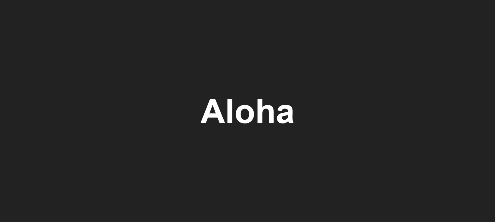

<h1>CS Technical Sessions Whiteboard</h1>

<h2>About</h2>

    This repository serves as a centralized hub for our CS internship technical
    sessions. Here, you'll find a record of topics covered, discussions held,
    and code snippets shared during sessions.

<h2>Branch Naming Convention</h2>

    After each technical session, if there's a need to showcase code to the
    participants, it will be added to a branch with the respective date. You can
    easily locate and review the code discussed on that specific day by browsing
    through the branch list.

<h2>How to Navigate</h2>
<ol>
    <li>Go to the <strong>Branches</strong> tab.</li>
    <li>
        Look for the branch corresponding to the date of the session you're
        interested in.
    </li>
    <li>
        Click on the branch to view the code changes made during that session.
    </li>
</ol>

Happy coding! 🚀

